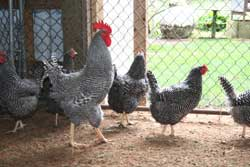

title: Lattin's Farm
css: default.css

# Lattin's Farm

Come see for yourself.

You can see and feed baby animals.
Every spring brings new arrivals.
The animals at Lattin’s are part of the family, too!
You can see chickens, roosters, bunnies, and so much more.
You can purchase a bag of food at the store and literally have them eating out of your hands.
There is nothing quite like the squeal of joy both kids and adults get by feeding the baby animals here at our farm.

Bring your children for a day at the farm.
It's an experience that will last a lifetime!

## Animal Sales

We may have chickens, ducks, bunnies, guinea pigs, and other animals for sale.
Please check our announcements, ask inside our store, or call the farm, [(360) 491-7328](tel:+1-360-491-7328), for more information.

### At the Bunny Shed

- Bunnies $50
- Dutch Bunnies $40
- Guinea Pigs $30

## Our Animals

### Dutch Bunnies

### Guinea Pigs

## Our Feathered Animals

### Barred Rock Chicken

### Geese

### Guinea Fowl

### Muscovy Duck

### Peacock and Peahen

### Quail

### Runner duck

### Silky chicken

### Turkeys

