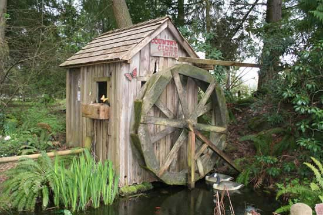

title: Lattin's Country Cider Mill and Farm
css: default.css

# Lattin's Country Cider Mill and Farm

---

1. [Cider](cider.html)
2. [Store](store.html)
3. [Farm](farm.html)
4. [Bakery](bakery.html)
5. [Gardens](gardens.html)
6. [Events](events.html)
7. [Tours](tours.html)
8. [Parties](parties.html)
9. [Calendar](calendar.html)
10. [Jobs](jobs.html)

---

## Welcome to Lattin’s Country Cider Mill and Farm

1. 

## About Us

Our small family owned farm has been in business since 1976 and we work year around to bring you the highest quality fruits and vegetables.
Our products are all homemade from natural ingredients -- just like your grandmother used to make!

We invite you to bring your family & friends, wander around our flower and vegetable gardens, picnic, and feed the animals.
Kids will enjoy our play area including a maze that’s open all year.
While you’re here, be sure to visit our farm's store!

All year long you can buy our award-winning apple cider, Eastern Washington Fruit, farm fresh eggs, fruit syrups, dried fruit, honey, jam, smoked salmon, Johnson’s Smokehouse meat & cheese products, crisp apples, and delicious frozen ready-to-bake pies.
Look for fresh seasonal fruit and produce.
Try our many assorted baked-fresh-daily pastries & donuts, and hot and cold ciders!
And stop by on Thursday & Friday before noon or Saturday & Sunday for great tasting apple fritters!

Join us for special [EVENTS](events.html) throughout the year.
Kids love our Easter Egg Hunt!
Our fall APPLE FESTIVAL features tractor-drawn wagon rides to our Pumpkin Patch, the Maze, and wonderful food & drinks.
We transform our farm into a WINTER WONDERLAND in December with thousands of lights.

We look forward to seeing you soon! \
*Carolyn Lattin* and daughters, *Debbie* & *Sherrie*

## Contact Us

Visit: [9402 Rich Road SE Olympia WA 98501](http://maps.apple.com/?daddr=9402%20Rich%20Road%20SE%20Olympia%20WA%2098501) \
Call: [(360) 491-7328](tel:+1-360-491-7328) \
Email: lattinscider@comcast.net \
Facebook: [Lattin's Cider](https://www.facebook.com/LattinsCider)

## Announcements

### Apple Fritters & Hot Cider

Come beat the winter blues with freshly made apple fritters and fresh hot cider Thursday, Friday, and Saturday!
We make fresh cider every Monday.

### Get Ready for Spring

New babies will arrive!
Cute and cuddly... 
The first produce arrives, too.

### Firewood Sale!

We have about two cords of dry firewood for sale!
$350, you haul.
Please pay cashier first.

## We’re Open All Year!

### January through May

9 am to 5:30 pm Monday to Saturday

### June through December

9 am to 5:30 pm Monday to Saturday \
9 am to 4 pm Sundays

## Orders, Requests, and Pre-Orders

Please call the store, [(360) 491-7328](tel:+1-360-491-7328), and let us know what you want and when you want it.

