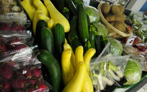
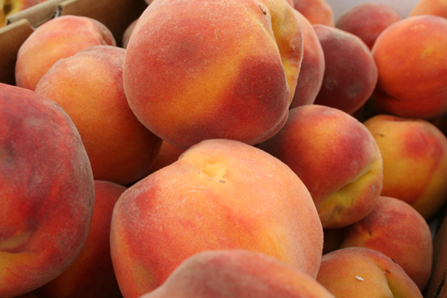
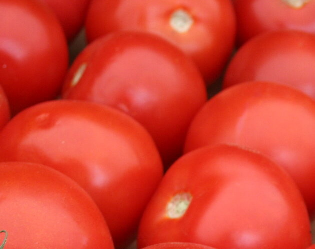
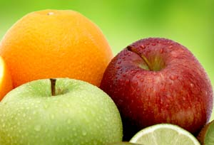

title: Lattin's Country Store
css: default.css

0. [Home](index.html)
1. [Cider](cider.html)
3. [Farm](farm.html)
4. [Bakery](bakery.html)
5. [Gardens](gardens.html)
6. [Events](events.html)
7. [Tours](tours.html)
8. [Parties](parties.html)
9. [Calendar](calendar.html)
10. [Jobs](jobs.html)

# Lattin's Country Store

1. 

Visit our country store with all kinds of gift ideas for everyone.

People come from all over South Puget Sound just for our fruit!
We partner with reliable growers in Washington to ensure we always have the best selection!
Shop here for a wide variety of **apples**, **peaches**, **berries**, **plums**, and **pears**.

With our ability to refrigerate apples and pears at just the right temperature, you can be assured of a crisp mouthful when you bite into them any time of year!

Stop in and enjoy our famous apple fritters, if you don’t think you like fritters you just haven’t had these.
They melt in your mouth leaving you wanting more!
We also bake Christmas cookies and make a variety of yummy desserts.
Thinking of a perfect home-baked dessert?
We have a wide assortment of ready-to-bake frozen pies.
If you’re planning ahead for the holidays, pick yours up early or call and place your order so it will be waiting for you.

## Orders, Requests, and Pre-Orders

*Please call* the farm, [(360) 491-7328](tel:+1-360-491-7328), *ahead of time* if you are looking for a specific amount of produce by the box.

## Our Products

### Jam

### Syrup

### Apple Sauce

### Apple Butter

### Dried Apple Chips

## Apples

We use a lot of apples each week in our cider.
Expect a variety of fresh apples!

### Braeburn

### Fuji

### Gala

### Granny Smith

### Honey Crisp

### Jonagold

### Pink Lady

